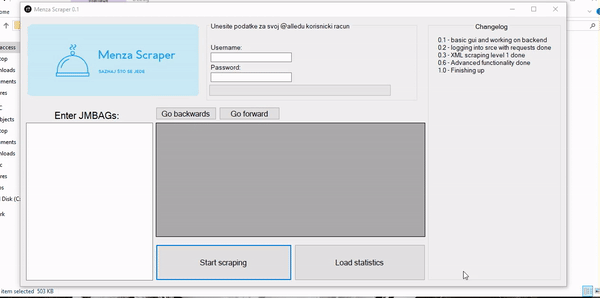

# Menza-scraper

Web Scraping tool created in C# using Windows Forms. It uses an exploit to scrape https://www.srce.unizg.hr/ and get receipt data for restaurant visits of any student as long as you have their JMBAG number. This was my final project for the "Object Oriented Programming 2" class and it scored an A.

As of since they have completely remade their backend system in an attempt to patch it. It's still possible to update it should I ever need to as the exploit still works.
