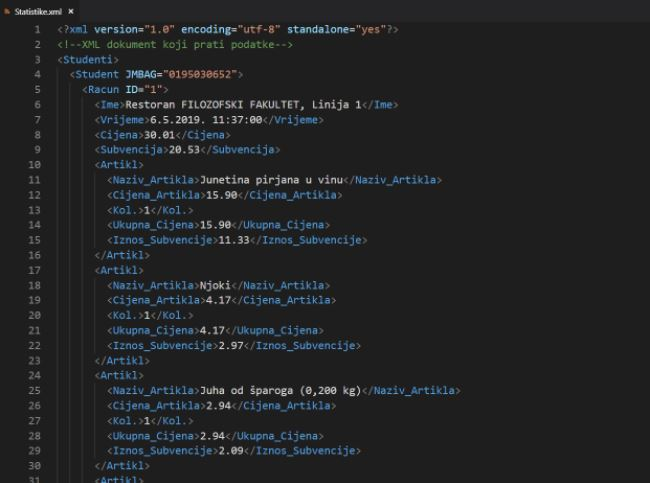

# Menza-scraper
As of 2021. SRCE seems to have finally fixed this exploit which is definitely a good thing because it could leaked some other personal information such as OIBs, images, phone numbers, addresses etc.

The basic gist of this exploit was: their backend had a GET endpoint that lets you receive user information and or receipt data for a student. To access this route you had to possess a valid JWT token. The route protection only checked that you were logged in and not who was the logged in user. The endpoint knew which user data to return based on the OIB and JMBAG you sent it. 
Now here lied another problem in their system. As you may know JMBAGS are not exactly private and many colleges post lists of them that can be seen or grabbed/scraped from the public domain. This means that someone could potentially grab all of the JMBAGs of an entire college just based on test results if they wanted to. So, knowing this fact, you will be shocked to learn that their system autofilled the correct OIB and returned personal data for any student as long as you had their JMBAG and a valid JWT token.

Web Scraping tool created in C# using Windows Forms. It uses an exploit to scrape https://www.srce.unizg.hr/ and get receipt data for restaurant visits of any student as long as you have their JMBAG number. This was my final project for the "Object Oriented Programming 2" class and it scored an A.

